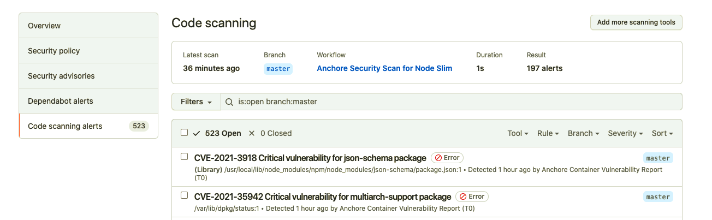

# FIWARE Cybersecurity Analysis

<!-- PROJECT LOGO -->
<br />
<div align="center">
  <a href="https://github.com/flopezag/fiware-security">
    
  </a>

<h3 align="center">FIWARE Cybersecurity Analysis of the FIWARE Generic Enablers</h3>

  <p align="center">
    <!--<a href="https://github.com/flopezag/fiware-security"><strong>Explore the docs »</strong></a>
    <br />
    <br />
    <a href="https://github.com/flopezag/fiware-security">View Demo</a>
    ·-->
    <a href="https://github.com/flopezag/fiware-security/issues">Report Bug</a>
    ·
    <a href="https://github.com/flopezag/fiware-security/issues">Request Feature</a>
  </p>
</div>

## Overview

Automatically scan a particular local docker image or all local docker containers 
with [Clair Vulnerability Scanner](https://github.com/coreos/clair) using 
[Clair-Scanner](https://github.com/arminc/clair-scanner) and 
[clair-local-scan](https://github.com/arminc/clair-local-scan) together with together 
with the [Docker Bench for Security](https://github.com/docker/docker-bench-security) 
to check common best-practices around deploying FIWARE Docker containers in production. 

The tests are all automated, and are inspired by the 
[CIS Docker Community Edition Benchmark v1.1.0](https://benchmarks.cisecurity.org/tools2/docker/CIS_Docker_Community_Edition_Benchmark_v1.1.0.pdf).


## Installation

There are two ways to install and execute the code. The first one is installing locally
the configuration files and script to execute the [docker-compose](https://docs.docker.com/compose/) 
locally (see [README.md](docker/README.md)) or [Ansible](https://www.ansible.com/) to deploy 
a virtual machine inside [FIWARE Lab](https://cloud.lab.fiware.org) and preconfigure all 
the system to launch the scan automatically (see [README.md](deploy/README.md)).

## Executing FIWARE Docker Security Scan locally

This is the option when you want to execute locally the scan over some FIWARE GE or over the
complete list of FIWARE GEs.

### Prerequisites

* Docker version 18.09.1 (or newer)
* docker-compose version 1.23.2 (or newer)

### Configuration

The only things that you have to do is download the [scan.py](scan.py) 
file in your local folder to execute the corresponding security scanner over the selected 
FIWARE GE or over the predefined set of FIWARE GEs (see [enablers.json](enablers.json)).

The execution of this script automatically download the following files:
- [docker-compose](docker-compose.yml)
- [default FIWARE GEs](enablers.json)

And it will clone as well the [Docker Bench Security](https://github.com/docker/docker-bench-security) 
folder to make the CIS Docker Benchmark nalyse.

Before launching the script, it is needed to configure the credentials to access to the 
[FIWARE Nexus instance](https://nexus.lab.fiware.org). It will be the place in which we
store the results of the execution of the scan for historical reasons.

### Execution

You can obtain a help description about the execution of the script just executing the 
following command:

```bash
./container-scan.py -h
```

Which show the following content:

```bash
usage: container-scan.py [-h] [-p] [-v] [-d DOCKER_IMAGE]

Perform security analysis of the FIWARE GE docker images.

optional arguments:
  -h, --help            show this help message and exit
  -p, --pull            Pull the docker image from Docker Hub
  -v, --verbose         Verbose screen output
  -d DOCKER_IMAGE, --docker_image DOCKER_IMAGE
                        Name of the Docker Image to be analysed. If it is not
                        provided the Docker images are obtained from the
                        enablers.json file.
```    

The script will produce 2 files for each FIWARE GE in json format with the format:

```text
<name of ge><date>_<time>.json
``` 

Inside this folder and into the docker-bench-security folder.

Once that we get the files we can get the numbers of security vulnerabilies issues
just executing the following shell commands with the use of the jq program for the
CVE vulnerabilities:

```bash
for a in Low Medium High; 
do 
  data=$(more more <name of ge><date>_<time>.json | jq ".[].vulnerabilities[].severity | select (.==\"${a}\")" | wc -l)
  echo $a  $data
done
```

In case of the CIS Docker Benchmark (security best practices) execute the following scripts:

```bash
for a in WARN PASS INFO PASS; 
do 
  data=$(more docker-bench-security.sh.log.json | jq ".tests[].results[].result | select (.==\"${a}\")" | wc -l)
  echo $a  $data
done
```

Last but not least, we have to stop the corresponding container for clair and db.

```bash
$ docker ps

CONTAINER ID        IMAGE                            COMMAND                  CREATED             STATUS                  PORTS               NAMES
0ef0d8e240f8        arminc/clair-local-scan:latest   "/clair -config=/con…"   29 hours ago        Up 29 hours (healthy)   6060-6061/tcp       docker_clair_1
3780c4add4a5        arminc/clair-db:latest           "docker-entrypoint.s…"   29 hours ago        Up 29 hours (healthy)   5432/tcp            docker_db_1

$ docker stop 0ef0d8e240f8 3780c4add4a5
0ef0d8e240f8
3780c4add4a5
```

## Adding the Anchore Scan GitHub Action Workflow to a repository directly

Anchore provide a [GitHub Action](https://github.com/anchore/scan-action) for Vulnerability Scanning.
Two sample GitHub Action Workflows have been added to this repository.

For example, to enable an Anchore Scan of a Docker image based on **node-slim**:

-  Copy the [anchore-node-slim.yaml](https://github.com/flopezag/fiware-security/blob/master/.github/workflows/anchore-node-slim.yml) file to `.github/workflows/anchore-node-slim.yml
-  Amend the Dockerfile [context location](https://github.com/flopezag/fiware-security/blob/master/.github/workflows/anchore-node-slim.yml#L34) if necessary - the example assumes a folder called `docker` is used.
-  After committing and pushing the file, run the new GitHub Action [manually](https://docs.github.com/en/actions/managing-workflow-runs/manually-running-a-workflow)

A security report will be displayed on
`https://github.com/<Owner>/<Repository>/security/code-scanning?query=is%3Aopen+branch%3Amaster+severity%3Aerror`




Like any GitHub Action Workflow, the creation of additional Docker images to scan
can also be added to a repository and creation can be arbitrarily more complex.
A second example file shows how to build an [alternative base image](https://kuberty.io/blog/best-os-for-docker/)
using `--build-arg` parameters on the command line to create a container based on [Red Hat UBI (Universal Base Image) 8](https://developers.redhat.com/articles/2021/11/08/optimize-nodejs-images-ubi-8-nodejs-minimal-image). To scan this alternate image, just copy
over [anchore-ubi.yaml](https://github.com/flopezag/fiware-security/blob/master/.github/workflows/anchore-ubi.yml) to `.github/workflows/anchore-ubi.yml`

## Credits

* Docker
* [Anchore]
* [Docker Bench Security](https://github.com/docker/docker-bench-security)

## License

These scripts are licensed under Apache License 2.0.